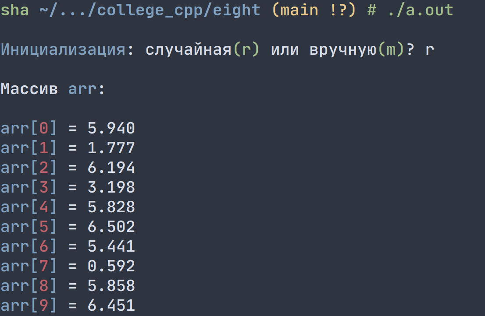
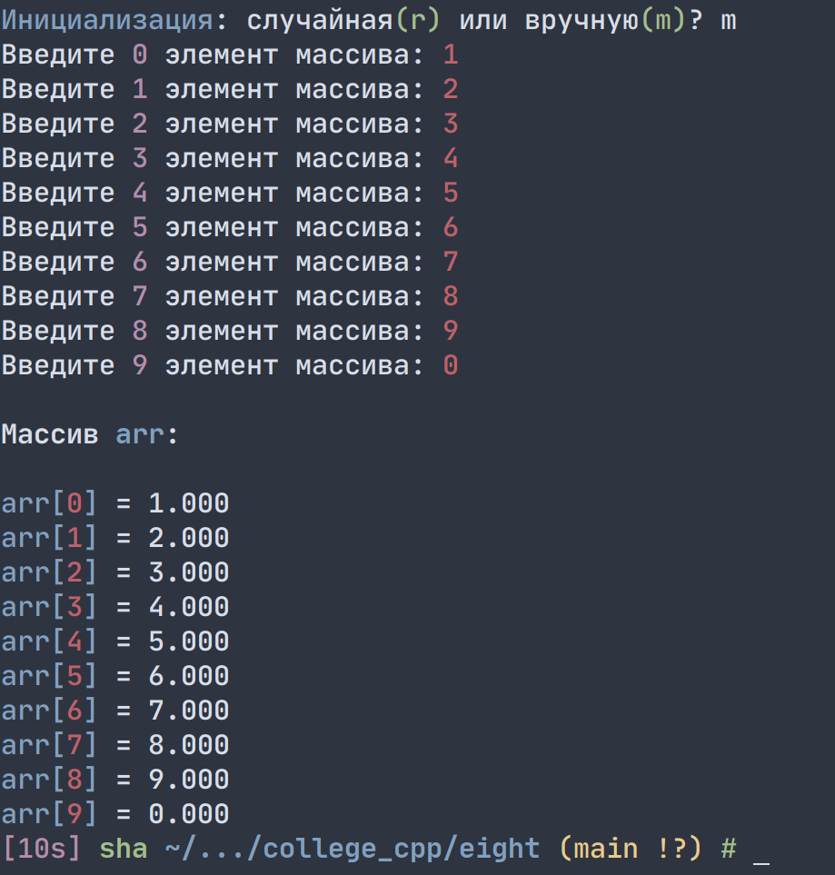
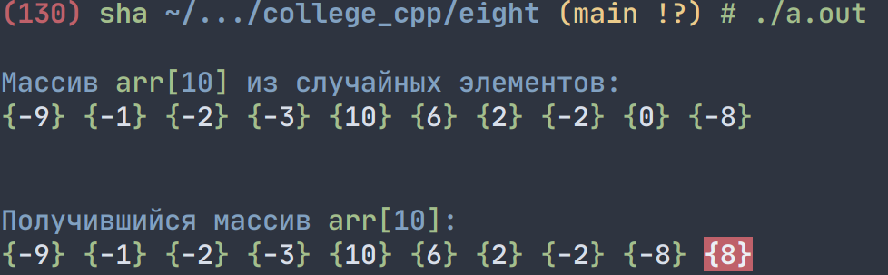
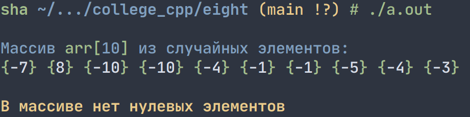
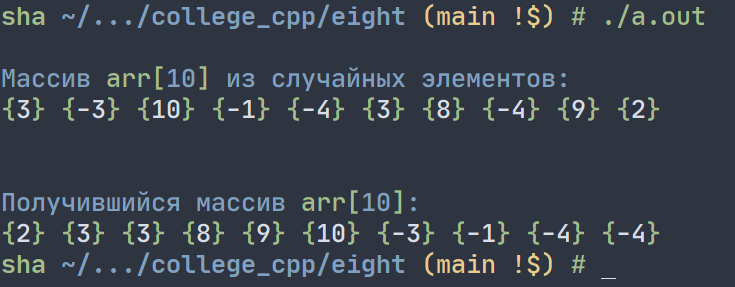

# Лабораторная работа 8


## Задание 1
_Создать массив из 10 элементов. Размерность массива задать именованной константой. Каждый элемент массива – действительное число с тремя знаками после запятой. Предусмотреть случайную инициализацию элементов массива и инициализацию вручную._


**Решение:**


```cpp
#include <iostream>
#include <time.h>

using namespace std;

int main(void) {

    // random seed
    srand(time(0));

    const int SIZE = 10;   // размер массива - константа

    float arr[SIZE];

    while (1) {
        char input;
        cout << "\n\033[94mИнициализация\033[0m: случайная\033[92m(r)\033[0m или вручную\033[92m(m)\033[0m? ";
        cin >> input;

        if (input == 'm') {
            for (int i = 0; i < SIZE; i++) {
                cout << "Введите " << i << " элемент массива: ";
                cin >> arr[i];
            }
        } else if (input == 'r') {
            for (int i = 0; i < SIZE; i++) {
                arr[i] = (float(rand())/float(RAND_MAX)) * 6.9;
            }
        } else { continue; }
        break;
    }

    // вывод содержимого
    printf("\n\033[0;1mМассив \033[1;34marr\033[0;1m:\033[0m\n\n");
    for (int i = 0; i < SIZE; i++) {
        printf("\033[94marr[\033[0;91m%d\033[0;94m]\033[0m = %.3f\n", i, arr[i]);
    }
}

```


## Задание 2
_Найти первый нулевой элемент массива, заменить его индексом и поставить в конец массива._

**Решение:**


Если в массиве нет нулевых элементов, программа выведет ошибку:


```cpp
#include <iostream>
#include <time.h>

using namespace std;

/* Найти первый нулевой элемент массива, заменить его индексом и поставить в конец массива */

int main(void) {

    // random seed
    srand(time(0));

    // размер массива - константа
    const int SIZE = 10;

    // создаем случайный массив с SIZE элементами и разбросом [-10; +10]
    int arr[SIZE];
    for (int i = 0; i < SIZE; i++) {
        arr[i] = rand() % 21 - 10;
    }

    // выводим получившийся массив
    cout << "\n\033[94mМассив \033[92marr[\033[94m" << SIZE << "\033[92m]\033[94m из случайных элементов:\033[0m\n";
    for (int i = 0; i < SIZE; i++) {
        cout << "\033[92m{\033[0m" << arr[i] << "\033[92m}\033[0m ";
    }
    printf("\n\n");

    
    // ищем первый нулевой элемент
    int first_null = -1;
    for (int i = 0; i < SIZE; i++) {
        if (arr[i] == 0) {
            first_null = i;
            break;
        }
    }
    if (first_null == -1) {
        cout << "\033[1;33mВ массиве нет нулевых элементов\033[0m\n";
        return 0;
    }
    
    // заменяем его индексом
    arr[first_null] = first_null;

    // пузырьковая сортировка
    for (int i = 0; i < SIZE; i++) {
        for (int j = 0; j < (SIZE - 1); j++) {
            if (arr[j] == first_null) {
                    int tmp = arr[j];
                    arr[j] = arr[j + 1];
                    arr[j + 1] = tmp; 
            }
        }
    }

    // выводим получившийся массив
    cout << "\n\033[94mПолучившийся массив \033[92marr[\033[94m" << SIZE << "\033[92m]\033[94m:\033[0m\n";
    for (int i = 0; i < SIZE; i++) {
        if (i == 9) {
            cout << "\033[1;41;37m{" << arr[i] << "}\033[0m ";
        } else {
            cout << "\033[92m{\033[0m" << arr[i] << "\033[92m}\033[0m ";
        }
    }
    printf("\n");    

}
```


## Задание 3
_Положительные элементы переставить в начало массива и расположить в порядке возрастания._


**Решение:**




```cpp
#include <iostream>
#include <time.h>

using namespace std;

/* Положительные элементы переставить в начало массива и расположить в порядке возрастания */

int main(void) {

    // random seed
    srand(time(0));

    // размер массива - константа
    const int SIZE = 10;

    // создаем случайный массив с SIZE элементами и разбросом [-10; +10]
    int arr[SIZE];
    for (int i = 0; i < SIZE; i++) {
        arr[i] = rand() % 21 - 10;
    }

    // выводим получившийся массив
    cout << "\n\033[94mМассив \033[92marr[\033[94m" << SIZE << "\033[92m]\033[94m из случайных элементов:\033[0m\n";
    for (int i = 0; i < SIZE; i++) {
        cout << "\033[92m{\033[0m" << arr[i] << "\033[92m}\033[0m ";
    }
    printf("\n\n");

    // сортировка выбором
    for (int i = SIZE - 1; i >= 0; i--) {
        if (arr[i] < 0) {
            int temp = i;
            int max = arr[i];
            int max_ind = -1;
            for (int j = i + 1; j < SIZE; j++) {
                if (arr[j] > 0) {
                    int t = arr[j];
                    arr[j] = arr[temp];
                    arr[temp] = t;
                    temp = j;
                }          
            }
        }
    }

    // узнаем последний положительный элемент в получившемся массиве
    int last_positive = 0;
    for (int i = 0; i < SIZE; i++) {
        if (arr[i] < 0) {
            last_positive = i - 1;
            break;
        }
    } 

    // если все элементы массива - положительные числа, то сортируем весь массив
    if (last_positive == 0)
        last_positive == SIZE;

    // пузырьковая сортировка положительных элементов по возрастанию
    int temp;
    for (int i = 0; i <= last_positive; i++) {
        for (int j = 0; j < last_positive; j++) {
            if (arr[j] > arr[j + 1]) {
                temp = arr[j];
                arr[j] = arr[j + 1];
                arr[j + 1] = temp;
            }
        }
    }

    // выводим получившийся массив
    cout << "\n\033[94mПолучившийся массив \033[92marr[\033[94m" << SIZE << "\033[92m]\033[94m:\033[0m\n";
    for (int i = 0; i < SIZE; i++)
        cout << "\033[92m{\033[0m" << arr[i] << "\033[92m}\033[0m ";
    printf("\n");    

}
```

