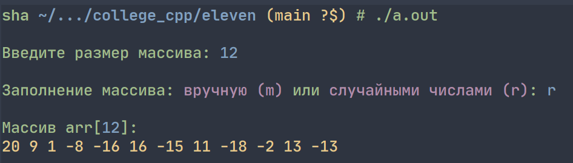
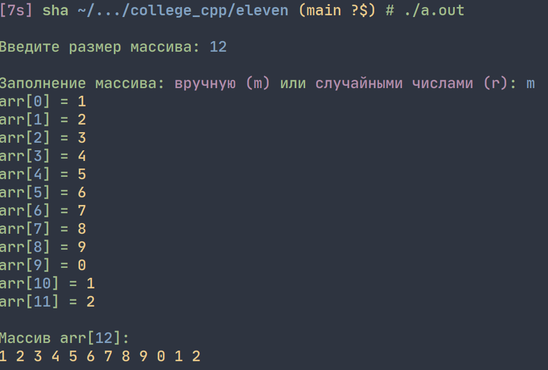
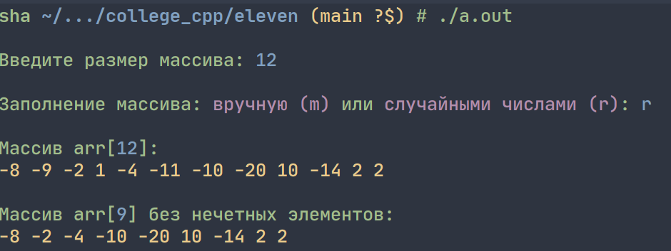
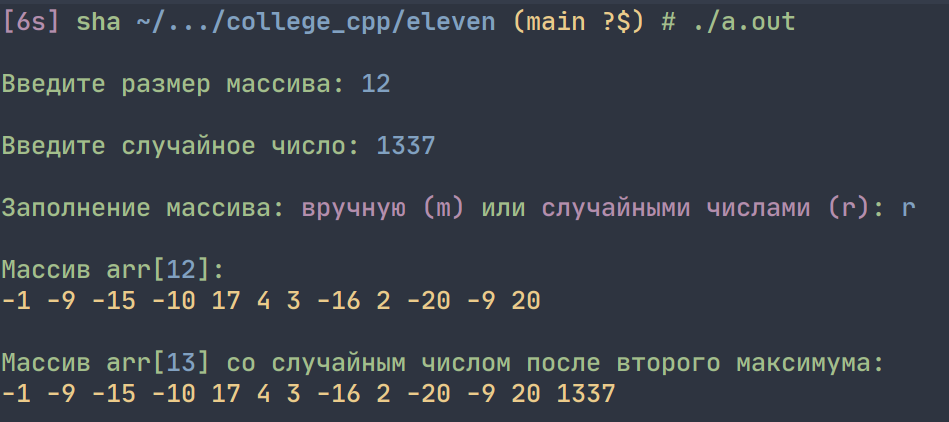

# Лабораторная работа 11


## Задание 1
_Создать одномерный динамический массив. Размер массива вводится с клавиатуры. Заполнить массив случайно целыми числами из промежутка `[–20, 20]`. Предусмотреть ручной ввод элементов массива._


**Решение:**




```cpp
#include <iostream>
#include <stdlib.h>
#include <time.h>

using namespace std;

int main(void) {

    // случайное число для rand()
    srand(time(0));

    // размер массива, определяется пользователем
    int size;
    printf("\n\033[92mВведите размер массива: \033[94m");
    scanf("%d", &size);

    // объявление массива и выделение памяти под него
    int *arr = (int*) calloc(size, sizeof(int));

    while (1) {
        printf("\n\033[92mЗаполнение массива: \033[95mвручную (m) \033[92mили \033[95mслучайными числами (r)\033[92m: \033[94m");
        char answer; cin >> answer;
        if (answer == 'm') {
            // заполнение массива вручную
            for (int i = 0; i < size; i++) {
                printf("\033[92marr[\033[94m%d\033[92m]\033[92m = \033[93m", i);
                scanf("%d", &arr[i]);
            }
            break;
        } else if (answer == 'r') {
            // заполнение массива случайно целыми числами из промежутка [-20; 20]
            for (int i = 0; i < size; i++)
                arr[i] = (int) rand() % 41 - 20;
            break;
        } else {continue;}
    }

    // вывод массива
    printf("\n\033[92mМассив arr[\033[94m%d\033[92m]:\033[0m\n", size);
    for (int i = 0; i < size; i++)
        printf("\033[93m%d ", arr[i]);
    printf("\033[0m\n\n");

    // освобождение памяти
    free(arr);
}
```


## Задание 2

_Из полученного в задании 1 массива удалить нечетные элементы._




**Решение:**
```cpp
#include <iostream>
#include <stdlib.h>
#include <time.h>

using namespace std;

/* Удалить нечетные элементы */

int main(void) {

    // случайное число для rand()
    srand(time(0));

    // размер массива, определяется пользователем
    int size;
    printf("\n\033[92mВведите размер массива: \033[94m");
    scanf("%d", &size);

    // объявление массива и выделение памяти под него
    int *arr = (int*) calloc(size, sizeof(int));

    while (1) {
        printf("\n\033[92mЗаполнение массива: \033[95mвручную (m) \033[92mили \033[95mслучайными числами (r)\033[92m: \033[94m");
        char answer; cin >> answer;
        if (answer == 'm') {
            // заполнение массива вручную
            for (int i = 0; i < size; i++) {
                printf("\033[92marr[\033[94m%d\033[92m]\033[92m = \033[93m", i);
                scanf("%d", &arr[i]);
            }
            break;
        } else if (answer == 'r') {
            // заполнение массива случайно целыми числами из промежутка [-20; 20]
            for (int i = 0; i < size; i++)
                arr[i] = (int) rand() % 41 - 20;
            break;
        } else {continue;}
    }

    // вывод массива
    printf("\n\033[92mМассив arr[\033[94m%d\033[92m]:\033[0m\n", size);
    for (int i = 0; i < size; i++)
        printf("\033[93m%d ", arr[i]);
    printf("\033[0m\n\n");

    // удаление нечетных элементов
    for (int i = 0; i < size; i++)
        if (arr[i] % 2 != 0) {
            for (int j = i; j < (size - 1); ++j)
                arr[j] = arr[j + 1];
            size--;
            i--;
        }

    // перераспределение памяти
    arr = (int*) realloc(arr, size * sizeof(int));

    // вывод массива
    printf("\033[92mМассив arr[\033[94m%d\033[92m] без нечетных элементов:\033[0m\n", size);
    for (int i = 0; i < size; i++)
        printf("\033[93m%d ", arr[i]);
    printf("\033[0m\n\n");

    // освобождение памяти
    free(arr);
}
```


## Задание 3

_Ввести произвольное целое число с клавиатуры и вставить его после второго максимума._




**Решение:**

```cpp
#include <iostream>
#include <stdlib.h>
#include <time.h>

using namespace std;

/* Ввести произвольное целое число с клавиатуры и вставить его после второго максимума. */

int main(void) {

    // случайное число для rand()
    srand(time(0));

    // размер массива, определяется пользователем
    int size, number;
    printf("\n\033[92mВведите размер массива: \033[94m");
    scanf("%d", &size);
    printf("\n\033[92mВведите случайное число: \033[94m");
    scanf("%d", &number);

    // объявление массива и выделение памяти под него
    int *arr = (int*) calloc(size, sizeof(int));

    while (1) {
        printf("\n\033[92mЗаполнение массива: \033[95mвручную (m) \033[92mили \033[95mслучайными числами (r)\033[92m: \033[94m");
        char answer; cin >> answer;
        if (answer == 'm') {
            // заполнение массива вручную
            for (int i = 0; i < size; i++) {
                printf("\033[92marr[\033[94m%d\033[92m]\033[92m = \033[93m", i);
                scanf("%d", &arr[i]);
            }
            break;
        } else if (answer == 'r') {
            // заполнение массива случайно целыми числами из промежутка [-20; 20]
            for (int i = 0; i < size; i++)
                arr[i] = (int) rand() % 41 - 20;
            break;
        } else {continue;}
    }
    // вывод массива
    printf("\n\033[92mМассив arr[\033[94m%d\033[92m]:\033[0m\n", size);
    for (int i = 0; i < size; i++)
        printf("\033[93m%d ", arr[i]);
    printf("\033[0m\n\n");

    // определение максимумов массива
    int max1Index, max1 = 0, max2Index, max2 = 0;
    for (int i = 0; i < size; i++) {
        if (arr[i] > max2) {
            max1 = max2;
            max1Index = max2Index;
            max2 = arr[i];
            max2Index = i;
        } else if (arr[i] > max1) {
            max1 = arr[i];
            max1Index = i;
        }
    }

    // добавление места для одного элемента массива
    size++;
    // перераспределение памяти
    arr = (int*) realloc(arr, size * sizeof(int));

    // смещение элементов вправо
    for (int i = size; i > max2Index; i--) {
        arr[i] = arr[i - 1];
    }
    // добавление числа после второго максимума
    arr[max2Index + 1] = number;

    // вывод массива
    printf("\033[92mМассив arr[\033[94m%d\033[92m] со случайным числом после второго максимума:\033[0m\n", size);
    for (int i = 0; i < size; i++)
        printf("\033[93m%d ", arr[i]);
    printf("\033[0m\n\n");

    // освобождение памяти
    free(arr);
}
```