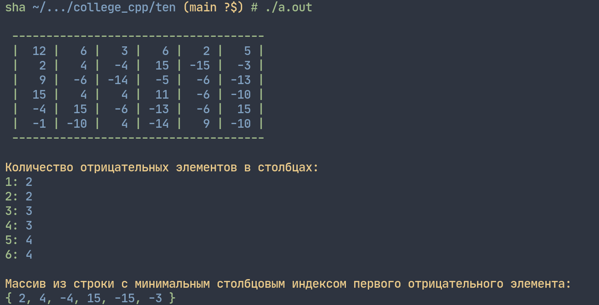
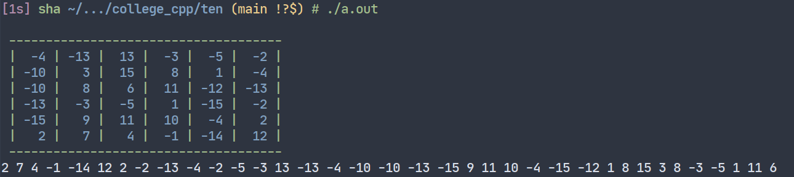

# Лабораторная работа 10


## Задание 1
_Сформировать двумерный целочисленный массив размера `6*6` и заполнить его случайным образом числами из диапазона `[–15; 15]`._

_Из полученного массива:_
1. _Сформировать одномерный массив, элементы которого равны количествам отрицательных элементов в столбцах._
2. _Сформировать одномерный массив из строки с минимальным столбцовым индексом первого отрицательного элемента._


**Решение:**



```cpp
#include <iostream>
#include <time.h>

using namespace std;

/* Сформировать двумерный целочисленный массив размера 6*6 и
заполнить его случайным образом числами из диапазона [–15; 15]. 
Из полученного массива 
1. Сформировать одномерный массив, элементы которого
равны количествам отрицательных элементов в столбцах.
2. Сформировать одномерный массив из строки с
минимальным столбцовым индексом первого
отрицательного элемента. */

int main(void) {

    // random seed
    srand(time(0));

    // размер массива - константы
    const int arrX = 6;
    const int arrY = 6;

    // объявление массива
    int arr [arrX] [arrY];

    // заполнение матрицы случайными числами от –15 до 15
    for (int i = 0; i < arrX; i++)
        for (int j = 0; j < arrY; j++)
            arr[i][j] = rand() % 31 - 15;

    // вывод исходной матрицы
    printf("\033[92m\n ");
    for (int i = 0; i < 37; i++)
        printf("-");
    printf("\033[0m\n");
    for (int i = 0; i < arrX; i++) {
        for (int j = 0; j < arrY; j++)
            printf(" \033[92m|\033[94m %3d", arr[i][j]);
        printf(" \033[92m| \r\n");
    }
    printf(" ");
    for (int i = 0; i < 37; i++)
        printf("-");
    printf("\033[0m\n");


    // одномерный массив, элементы которого равны количеству отрицательных элементов в столбцах
    int negElements[arrY] = {0};
    for (int i = 0; i < arrX; i++)
        for (int j = 0; j < arrY; j++)
            if (arr[i][j] < 0)
                negElements[j]++;
    printf("\n\033[93mКоличество отрицательных элементов в столбцах:\033[0m\n");
    for (int i = 0; i < arrY; i++)
        printf("\033[92m%d: \033[94m%d\033[0m \n", i + 1, negElements[i]);
    printf("\n");


    // одномерный массив из строки с минимальным столбцовым индексом первого отрицательного элемента
    int rowWithMinIndex = -1;
    for (int i = 0; i < arrX; i++) {
        for (int j = 0; j < arrY; j++)
            if (arr[i][j] < 0) {
                rowWithMinIndex = i;
            } else {continue;}
            break;
        if (rowWithMinIndex == i)
            break;
    }
    printf("\033[93mМассив из строки с минимальным столбцовым индексом первого отрицательного элемента:\n");
    printf("\033[92m{ ");
    for (int j = 0; j < arrX; j++) {
        printf("\033[94m%d", arr[rowWithMinIndex][j]);
        if (!(j == arrX - 1))
            printf("\033[92m, \033[0m");
    }
    printf("\033[92m } \033[0m");
    printf("\n");
}
```


## Задание 2
_Вывести элементы двумерного массива в заданном порядке: из левого нижнего угла против часовой стрелки по
спирали._


**Решение:**




```cpp
#include <iostream>
#include <time.h>

using namespace std;

/* Вывести элементы двумерного массива из левого нижнего угла против часовой стрелки по спирали. */

int main(void) {

    // случайное число для rand()
    srand(time(0));

    // размер массива - константы
    const int arrX = 6;
    const int arrY = 6;

    // объявление массива
    int arr [arrX] [arrY];

    // заполнение матрицы случайными числами от –15 до 15
    for (int i = 0; i < arrX; i++)
        for (int j = 0; j < arrY; j++)
            arr[i][j] = rand() % 31 - 15;

    // вывод исходной матрицы
    printf("\033[92m\n ");
    for (int i = 0; i < 37; i++)
        printf("-");
    printf("\033[0m\n");
    for (int i = 0; i < arrX; i++) {
        for (int j = 0; j < arrY; j++)
            printf(" \033[92m|\033[94m %3d", arr[i][j]);
        printf(" \033[92m| \r\n");
    }
    printf(" ");
    for (int i = 0; i < 37; i++)
        printf("-");
    printf("\033[0m\n");


    // https://www.codespeedy.com/print-a-matrix-in-counter-clockwise-spiral-in-cpp/
    int count = 0;
    int total = arrX * arrY;

    int i, a = 0, b = 0, c = arrX, d = arrY;
    
    while (1) {
        // Print the last row from the remaining rows  
        for (i = b; i < d; ++i) { 
            cout << arr[c - 1][i] << " "; 
            count++; 
        } 
        c--; 
  
        if (count == total) 
            break; 

        // Print the last column from the remaining columns  
        if (a < c) { 
            for (i = c - 1; i >= a; --i) { 
                cout << arr[i][d - 1] << " "; 
                count++; 
            } 
            d--; 
        }

        if (count == total) 
            break; 

        // Print the first row  from the remaining rows  
        if (b < d) { 
            for (i = d - 1; i >= b; --i) { 
                cout << arr[a][i] << " "; 
                count++; 
            } 
            a++; 
        }
        
        if (count == total) 
            break;
  
        // Print first column from remaining
        for (i = a; i < c; ++i) { 
            cout << arr[i][b] << " "; 
            count++; 
        } 
        b++;  

        if (count == total) 
            break; 
    }

    printf("\n");

}
```