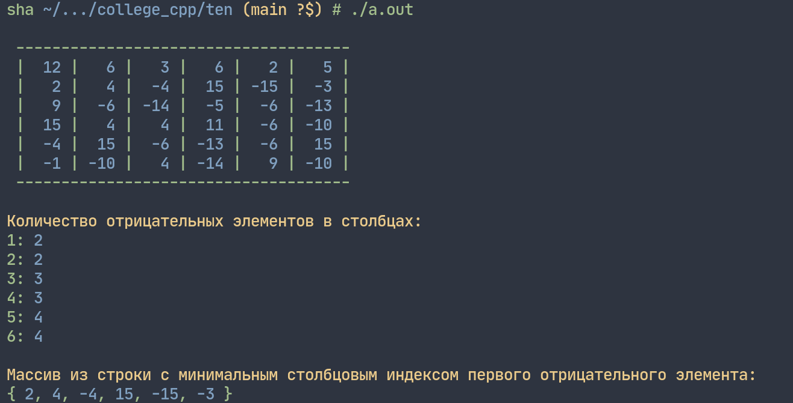

# Лабораторная работа 10


## Задание 1
_Сформировать двумерный целочисленный массив размера `6*6` и заполнить его случайным образом числами из диапазона `[–15; 15]`._

_Из полученного массива:_
1. _Сформировать одномерный массив, элементы которого равны количествам отрицательных элементов в столбцах._
2. _Сформировать одномерный массив из строки с минимальным столбцовым индексом первого отрицательного элемента._


**Решение:**



```cpp
#include <iostream>
#include <time.h>

using namespace std;

/* Сформировать двумерный целочисленный массив размера 6*6 и
заполнить его случайным образом числами из диапазона [–15; 15]. 
Из полученного массива 
1. Сформировать одномерный массив, элементы которого
равны количествам отрицательных элементов в столбцах.
2. Сформировать одномерный массив из строки с
минимальным столбцовым индексом первого
отрицательного элемента. */

int main(void) {

    // random seed
    srand(time(0));

    // размер массива - константы
    const int arrX = 6;
    const int arrY = 6;

    // объявление массива
    int arr [arrX] [arrY];

    // заполнение матрицы случайными числами от –15 до 15
    for (int i = 0; i < arrX; i++)
        for (int j = 0; j < arrY; j++)
            arr[i][j] = rand() % 31 - 15;

    // вывод исходной матрицы
    printf("\033[92m\n ");
    for (int i = 0; i < 37; i++)
        printf("-");
    printf("\033[0m\n");
    for (int i = 0; i < arrX; i++) {
        for (int j = 0; j < arrY; j++)
            printf(" \033[92m|\033[94m %3d", arr[i][j]);
        printf(" \033[92m| \r\n");
    }
    printf(" ");
    for (int i = 0; i < 37; i++)
        printf("-");
    printf("\033[0m\n");


    // одномерный массив, элементы которого равны количеству отрицательных элементов в столбцах
    int negElements[arrY] = {0};
    for (int i = 0; i < arrX; i++)
        for (int j = 0; j < arrY; j++)
            if (arr[i][j] < 0)
                negElements[j]++;
    printf("\n\033[93mКоличество отрицательных элементов в столбцах:\033[0m\n");
    for (int i = 0; i < arrY; i++)
        printf("\033[92m%d: \033[94m%d\033[0m \n", i + 1, negElements[i]);
    printf("\n");


    // одномерный массив из строки с минимальным столбцовым индексом первого отрицательного элемента
    int rowWithMinIndex = -1;
    for (int i = 0; i < arrX; i++) {
        for (int j = 0; j < arrY; j++)
            if (arr[i][j] < 0) {
                rowWithMinIndex = i;
            } else {continue;}
            break;
        if (rowWithMinIndex == i)
            break;
    }
    printf("\033[93mМассив из строки с минимальным столбцовым индексом первого отрицательного элемента:\n");
    printf("\033[92m{ ");
    for (int j = 0; j < arrX; j++) {
        printf("\033[94m%d", arr[rowWithMinIndex][j]);
        if (!(j == arrX - 1))
            printf("\033[92m, \033[0m");
    }
    printf("\033[92m } \033[0m");
    printf("\n");
}
```