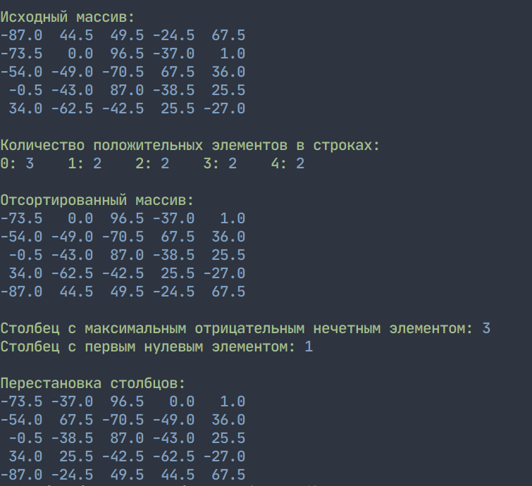
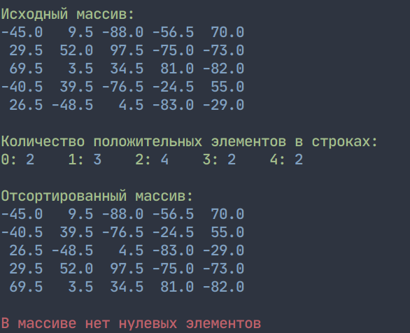

# Лабораторная работа 12


## Задание 1
_Сформировать двумерный динамический массив размера `m * n`, где `m` – число строк, `n` – число столбцов. Элементы массива вещественные. Заполнить полученный массив случайным образом. Выполнить сортировку строк массива в соответствии с их характеристикой, если характеристика – это количество положительных элементов строк._


## Задание 2
_Для полученного массива поменять местами два столбца, которые содержат максимальный отрицательный нечетный элемент матрицы и первый нулевой элемент._


**Решение:**




Если в массиве нет нулевых элементов, программа выведет ошибку:





```cpp
#include <iostream>
#include <time.h>

using namespace std;

int main(void) {

    // случайное число для функции rand()
    srand(time(0));

    int m = 5;  // число строк
    int n = 5;  // число столбцов

    // объявление динамического массива указателей
    double **arr = (double**) malloc(n * sizeof(double));

    // заполнение массива указателями
    for (int i = 0; i < n; i++)
        arr[i] = (double*) malloc(m * sizeof(double));

    // инициализация массива случайными числами
    for (int i = 0; i < n; i++)
        for (int j = 0; j < m; j++)
            arr[i][j] = (double) (rand() % 400 - 199) / 2.0;    // (-100.0; 100.0)

    // вывод матрицы
    cout << "\n\033[92mИсходный массив:\033[94m" << endl;
    for (int i = 0; i < m; i++) {
        for (int j = 0; j < n; j++)
            printf("%5.1f ", arr[i][j]);
        cout << endl;
    }


    // массив для положительных элементов строк
    int *sumOfAbsolutes = (int*) malloc(m * sizeof(int));

    // инициализация массива нулями
    for (int i = 0; i < m; i++)
        sumOfAbsolutes[i] = 0;

    // подсчет количества положительных элементов строк
    for (int i = 0; i < m; i++)
        for (int j = 0; j < n; j++)
            if (arr[i][j] > 0) sumOfAbsolutes[i]++;

    // вывод
    cout << "\n\033[92mКоличество положительных элементов в строках:" << endl;
    for (int i = 0; i < m; i++) 
        cout << "\033[92m" << i << ": \033[94m"<< sumOfAbsolutes[i] << "\t";
    cout << "\n\n";

    // сортировка
    for (int i = 0; i < (m - 1); i++)
        for (int j = i; j < m; j++)
            if (sumOfAbsolutes[i] > sumOfAbsolutes[j]) {
                double tmp = sumOfAbsolutes[i];
                sumOfAbsolutes[i] = sumOfAbsolutes[j];
                sumOfAbsolutes[j] = tmp;

                double *tmp2 = arr[i];
                arr[i] = arr[j];
                arr[j] = tmp2;
            }

    // вывод матрицы
    cout << "\033[92mОтсортированный массив:\033[94m" << endl;
    for (int i = 0; i < m; i++) {
        for (int j = 0; j < n; j++)
            printf("%5.1f ", arr[i][j]);
        cout << endl;
    }

    
    int columnWithMaxOddNum = 0;            // столбец с максимальным отрицательным нечетным элементом
    int firstNull = -1;                     // столбец с первым нулевым элементом

    for (int i = 0; i < m; i++)
        for (int j = 0; j < n; j++)
            if (arr[i][j] < 0 
            && arr[i][j] > arr[i][columnWithMaxOddNum] 
            && (int) arr[i][j] % 2 != 0)    // конвертация double в integer для проверки нечетности
                columnWithMaxOddNum = j;
    
    // поиск нулевого элемента
    for (int i = 0; i < m; i++) {
        for (int j = 0; j < n; j++)
            if (arr[i][j] == 0) {
                firstNull = j;
                /* Использование goto для выхода из вложенных циклов -
                единственный случай применения этой операции, который
                считается допустимым и используется как общепринятое 
                решение подобной задачи. Objections?
                Подробнее:
                https://stackoverflow.com/questions/38999850/how-do-you-break-out-of-nested-loops-in-c
                https://stackoverflow.com/questions/18670038/how-to-exit-nested-loops */
                goto brk;
            }
        brk: break;
    }

    if (firstNull == -1) {
        cout << "\n\033[91mВ массиве нет нулевых элементов\033[0m\n"; 
        return 0;
    }

    cout << "\n\033[92mСтолбец с максимальным отрицательным нечетным элементом: \033[94m" << columnWithMaxOddNum << endl;
    cout << "\033[92mСтолбец с первым нулевым элементом: \033[94m" << firstNull << endl;

    for (int i = 0; i < m; i++) {
        double temp = arr[i][columnWithMaxOddNum];
        arr[i][columnWithMaxOddNum] = arr[i][firstNull];
        arr[i][firstNull] = temp;
    }

    cout << "\n\033[92mПерестановка столбцов:" << endl;
    for (int i = 0; i < m; i++) {
        for (int j = 0; j < n; j++)
            printf("\033[94m%5.1f ", arr[i][j]);
        cout << "\n\033[0m";
    }

    // очистка памяти
    free(sumOfAbsolutes);
    for (int i = 0; i < n; i++)
        free(arr[i]);
    free(arr);
}
```
